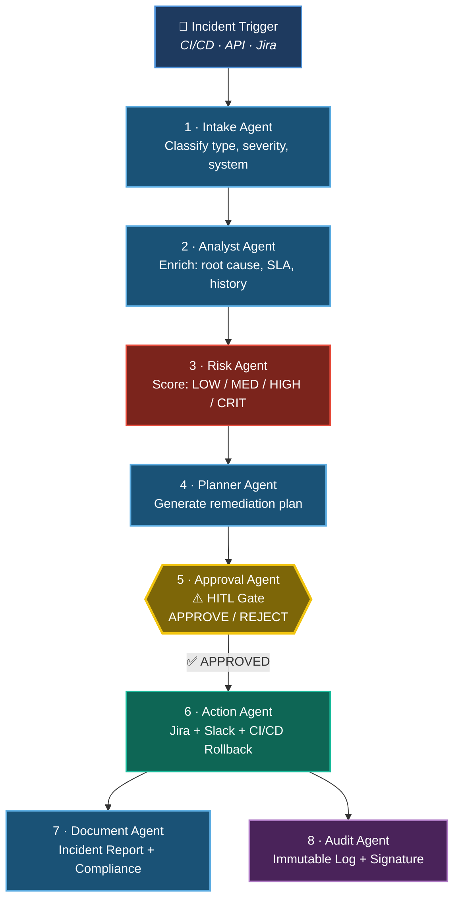

# StreamOps CommandMesh

> A governed multi-agent execution system for enterprise QA incident response built on the Airia platform.

[](https://airia.ai)
[](agents/)
[](LICENSE)

## What is StreamOps CommandMesh?

StreamOps CommandMesh is an 8-agent AI pipeline that autonomously handles QA incident response for enterprise streaming platforms. When a CI/CD failure or API degradation is detected, the pipeline triggers automatically:

```
Intake → Analyst → Risk → Planner → Approval (HITL) → Action → Document → Audit
```

No human needs to manually triage, escalate, notify, or document — the agents do it all, with a human-in-the-loop approval gate before any remediation actions are executed.

## The Problem

Enterprise QA teams in media/streaming face:
- CI/CD failures that take hours to triage and escalate
- Manual Jira ticket creation, Slack notifications, and incident reports
- No audit trail for compliance
- Approval bottlenecks causing delayed remediation

## Architecture



> Stages 7 and 8 are called as **nested agents** by the Action Agent — keeping orchestration clean and each agent stateless.

## Pipeline Flow

```mermaid
flowchart LR
    A["1 · Intake<br/><b>JSON</b>"]
    B["2 · Analyst<br/><b>JSON</b>"]
    C["3 · Risk<br/><b>Score</b>"]
    D["4 · Planner<br/><b>Plan</b>"]
    E{{"5 · Approval<br/><b>HITL Gate</b>"}}
    F["6 · Action<br/><b>Execute</b>"]
    G["7 · Document<br/><b>Report</b>"]
    H["8 · Audit<br/><b>Log</b>"]

    A --> B --> C --> D --> E -- "✅" --> F --> G --> H

    style A fill:#1a5276,stroke:#5dade2,color:#ffffff,stroke-width:2px
    style B fill:#1a5276,stroke:#5dade2,color:#ffffff,stroke-width:2px
    style C fill:#7b241c,stroke:#e74c3c,color:#ffffff,stroke-width:2px
    style D fill:#1a5276,stroke:#5dade2,color:#ffffff,stroke-width:2px
    style E fill:#7d6608,stroke:#f1c40f,color:#ffffff,stroke-width:3px
    style F fill:#0e6655,stroke:#1abc9c,color:#ffffff,stroke-width:2px
    style G fill:#1a5276,stroke:#5dade2,color:#ffffff,stroke-width:2px
    style H fill:#4a235a,stroke:#af7ac5,color:#ffffff,stroke-width:2px
```



## The Solution

StreamOps CommandMesh compresses incident response from hours to seconds:

| Stage | Agent | Output |
|---|---|---|
| 1 | Intake Agent | Classifies and routes the incident |
| 2 | Analyst Agent | Enriches with SLA data and root cause |
| 3 | Risk Agent | Scores risk (LOW/MEDIUM/HIGH/CRITICAL) |
| 4 | Planner Agent | Generates structured remediation plan |
| 5 | Approval Agent | HITL gate — human approves/rejects |
| 6 | Action Agent | Executes Jira, Slack, CI/CD rollback |
| 7 | Document Agent | Generates incident report and compliance docs |
| 8 | Audit Agent | Produces immutable audit log with signature |

## Try It Live

> **Note:** A free Airia account is required to run the agents. Signup takes under 60 seconds at [airia.ai](https://airia.ai).

- **[Try StreamOps Intake Agent](https://airia.ai/catalog?assistantId=dc954d79-a4ea-45f8-a60e-03583e4267b9)** — Start here, pipeline entry point
- **[Try StreamOps Action Agent](https://airia.ai/catalog?assistantId=add10598-2169-4adb-b79d-9ffdee0704ff)** — Full execution: Jira + Slack + Rollback

## Tech Stack

- **Platform:** Airia Agent Studio
- **Model:** GPT-4o (OpenAI)
- **Integrations:** Slack, Microsoft Teams, Jira (mocked in demo)
- **Output format:** Structured JSON + natural language dual-output
- **Orchestration:** Nested agent calls, HITL approval gate

## Golden Path Demo

See [`prompts/golden-path-demo.md`](prompts/golden-path-demo.md) for the exact input prompt and expected outputs used in testing.

## Agent Specifications

See the [`agents/`](agents/) folder for full prompt design, input/output schema, and purpose for each of the 8 agents.

## Architecture Deep Dive

See [`architecture.md`](architecture.md) for design decisions: why 8 agents, why HITL at Stage 5, nested agent patterns, and dual JSON + natural language output.

## Built By

**Partha Samal** — QA Engineer / AI Automation Specialist
Airia AI Agents Hackathon 2026
