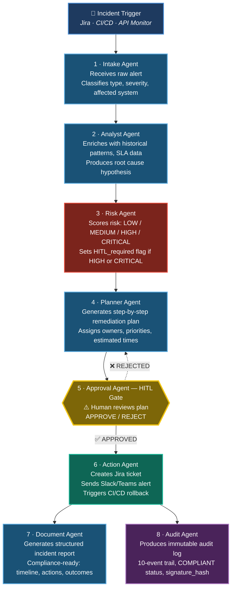

# StreamOps CommandMesh — Architecture

## Pipeline Overview

## Design Decisions

### Why 8 agents instead of 1?
Each agent has a single, well-defined responsibility. This enables:
- Independent testing of each stage
- Swappable models per stage (cheaper model for classification, GPT-4o for planning)
- Clear audit trail of which agent made which decision

### Why HITL at Stage 5?
Risk-scored incidents above HIGH require human sign-off before any real system actions (Jira, Slack, rollback). This prevents false-alarm fatigue and ensures accountability.

### Why dual JSON + natural language output?
The Action Agent produces both a machine-readable JSON payload (for downstream automation) and a human-readable Slack/Teams message. This enables both automated routing and immediate human comprehension.

### Nested Agent Architecture
The Action Agent calls the Document Agent and Audit Agent as nested agents, passing execution results downstream. This keeps orchestration clean and each agent stateless.

## Platform
Built entirely on Airia Agent Studio — no custom code required. All orchestration, model calls, prompt injection, and nested agent routing handled by the Airia runtime.
